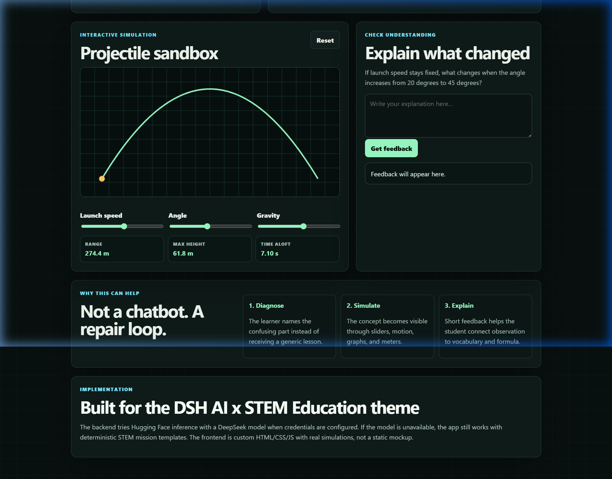
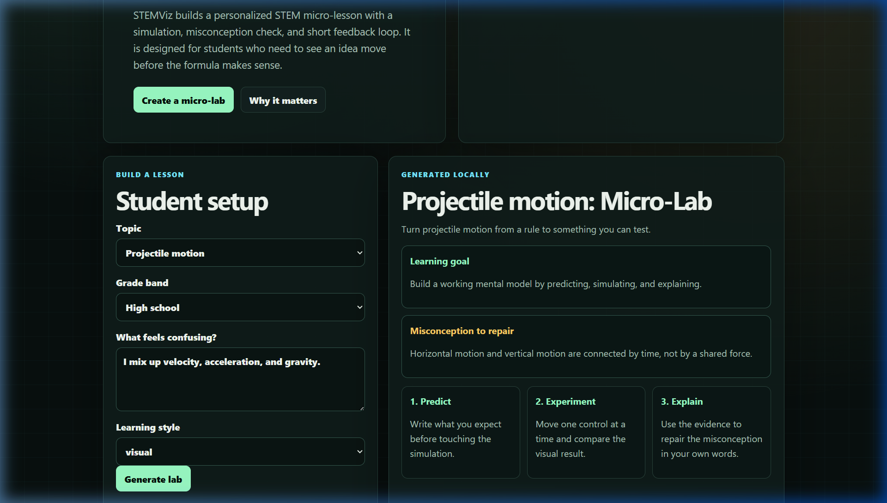
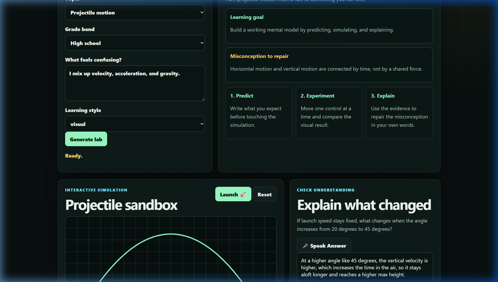

# STEMViz


**AI-generated interactive STEM micro-labs and adaptive simulations — powered by FastAPI and Google Gemini / DeepSeek fallbacks.**

STEMViz is a FastAPI backend and interactive frontend deployed on Google Cloud Run. It takes a student's topic, grade level, and specific conceptual struggle, and programmatically builds a complete interactive STEM micro-lab. It includes an interactive canvas simulation, a misconception-repair checklist, and a tutoring feedback loop to guide understanding in under 5 seconds.

---

## Live Service

| Resource | URL |
|----------|-----|
| **STEMViz Web Application** | [stemlens-lab-971465910048.us-central1.run.app](https://stemlens-lab-971465910048.us-central1.run.app) |
| **Health Check** | [/health](https://stemlens-lab-971465910048.us-central1.run.app/health) |

---

## Product Walkthrough

The hosted URL provides a fully interactive operational surface for students:

### 🖥️ Interactive Setup & Custom Lesson Generation
Allows the student to choose a topic, grade band, and learning style, and state what is confusing. The backend uses fallbacks across `DeepSeek-V4-Pro` -> `DeepSeek-V4-Flash` -> `DeepSeek-V4` to construct a customized mission card.


### 📊 Guided 3-Stage Checklist Engine (Predict → Experiment → Explain)
Active status indicators (`● In Progress` or `✓ Done`) guide students step-by-step.
- **Predict:** Completed when the student types what they expect to happen.
- **Experiment:** Activated when controls are touched, completing upon running the experiment.
- **Explain:** Activated when explanation is typed, completing once AI feedback is retrieved.


### 📈 Adaptive Simulation Sandboxes (Canvas Animations)
- **Projectile Motion Sandbox:** Animate the projectile ball in real time with the **Launch 🚀** button.
- **Ohm's Law Circuit Meter:** Observe electric current charge particles flowing through the wires with speed dynamically proportional to Current ($I = V/R$).
- **Linear Graph Explorer:** Watch a glowing tracer node glide back and forth along the function line.


---

## How It Works

```
Student Confusion Input
    ↓
Perceive Setup & Fallback Models (DeepSeek-V4-Pro → Flash → Deterministic Fallback)
    ↓
Generate Lab Mission (Title, Hook, Misconception, Checklist, Check Question, Hints)
    ↓
Interactive Sandbox Play (Interactive sliders with dynamic value readouts)
    ↓
Launch & Animate Simulation (Projectile flight, current particle speed, tracer glide)
    ↓
Student Explanation & AI Triage (Kind tutoring feedback corrects misconceptions)
    ↓
Checklist Completed
```

### Educational Capabilities

| Area | What STEMViz Provides |
|------|-----------------------|
| **Topic-Struggle Coupling** | Selecting a topic auto-updates typical struggles to save typing |
| **Zero-Typing Flow** | Suggestion helper chips and Speech-to-Text Voice Recognition |
| **Live Slider Value Readouts** | Sliders print active numeric values and units dynamically |
| **Interactive Canvas Animations**| Particle flows, line tracers, and triggerable launches |
| **Multi-Model Fallbacks** | Sequentially attempts DeepSeek models, falling back to local templates if API tokens are missing |

---

## Architecture

### Component Map

| File | Role |
|------|------|
| `app/main.py` | FastAPI server, HF Inference client, templates & API endpoints |
| `static/index.html` | HTML structure, setup forms, check sections, and Canvas wrappers |
| `static/app.js` | Simulation physics, global animation frame loops, checklist engines |
| `static/styles.css` | Color tokens, panel layouts, and glowing status badges |
| `test_app.py` | Automated FastAPI test client integration suite |
| `Dockerfile` | Uvicorn production container definition |

---

## Local Setup

**Prerequisites:** Python 3.11+

```powershell
# Clone and install
git clone https://github.com/PratikCreates/STEMViz.git
cd STEMViz
python -m venv .venv
.\.venv\Scripts\python.exe -m pip install -r requirements.txt
```

```ini
# Configure credentials (.env)
HF_TOKEN=your_hugging_face_token
HF_TEXT_MODEL=deepseek-ai/DeepSeek-V4-Pro
```

```powershell
# Run the local server
.\.venv\Scripts\python.exe -m uvicorn app.main:app --host 0.0.0.0 --port 8080
```

---

## Verification

```powershell
# Run automated API integration tests
.\.venv\Scripts\pytest test_app.py
```
