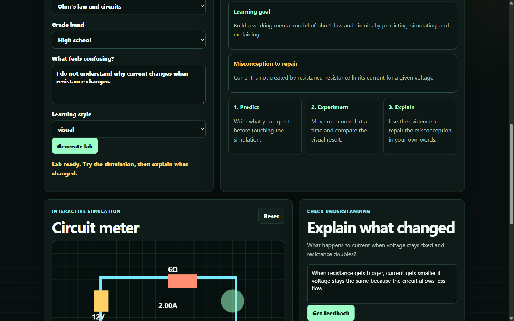

# STEMViz

STEMViz is an AI-powered STEM education prototype for DSH Hacks V1.

**Live Deployment URL:** [https://stemlens-lab-971465910048.us-central1.run.app](https://stemlens-lab-971465910048.us-central1.run.app)

The idea is simple: when a student says what feels confusing, the app builds a small interactive learning lab around that confusion. It is not just a chatbot response. It gives the student a mission, a simulation, a misconception to repair, and a short feedback loop.



## Why I Built This

A lot of STEM confusion is not caused by lack of effort. It happens because formulas are introduced before the student has a visual or physical model in their head.

Examples:

- projectile motion feels like one combined force problem instead of two independent motions connected by time
- Ohm's law feels like a memorized equation instead of a relationship between voltage, resistance, and current
- slope and intercept feel like symbols instead of visible graph behavior

STEMViz turns these into small experiments.

## What It Does

1. The student chooses a topic and describes what feels confusing.
2. The backend tries to generate a personalized mission using Hugging Face inference with a DeepSeek model.
3. If the model is unavailable, the app falls back to deterministic STEM templates so the demo still works.
4. The frontend shows an interactive simulation for the selected topic.
5. The student explains what changed.
6. The app gives concise feedback that helps repair the misconception.

## Built-In Labs

- Projectile motion sandbox
- Ohm's law circuit meter
- Linear equation graph explorer

## Tech Stack

- FastAPI
- Hugging Face Inference API
- DeepSeek text model support
- Custom HTML/CSS/JavaScript frontend
- Canvas-based STEM simulations

## Running Locally

```powershell
python -m venv .venv
.\.venv\Scripts\python.exe -m pip install -r requirements.txt
.\.venv\Scripts\python.exe -m uvicorn app.main:app --host 127.0.0.1 --port 8080
```

Open:

```text
http://127.0.0.1:8080
```

## Optional Hugging Face Configuration

Create a local `.env` file:

```ini
HF_TOKEN=your_hugging_face_token
HF_TEXT_MODEL=deepseek-ai/DeepSeek-V4
```

The app also checks `HUGGINGFACEHUB_API_TOKEN` and `HF_API_KEY`.

## Why It Fits DSH Hacks

| Criterion | How STEMViz Addresses It |
| --- | --- |
| Idea | Uses AI to create personalized STEM micro-labs, not generic tutoring text |
| Implementation | Combines model-generated lesson structure with real interactive simulations |
| Design | Custom interface built around a clear student workflow |
| Presentation | Easy to demo: choose topic, generate lab, move sliders, answer, receive feedback |
| Impact | Helps students who need visual and experimental grounding before formulas click |

## Future Work

- Add chemistry molecule balancing and biology diffusion labs
- Save learner progress over multiple sessions
- Add teacher mode for assigning micro-labs
- Add accessibility controls for lower-literacy and multilingual explanations
- Expand feedback using rubric-based misconception detection

## Connect

[Pratik Shah](https://www.linkedin.com/in/pratikcreates)
